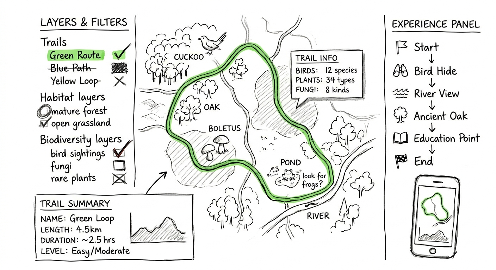

# Biodiversity Mapping & Eco-Trail Web App — New Forest

---

## Exploring Nature Through Data

What if a forest could explain itself?

While trekking through the New Forest, I found myself constantly switching between apps — trying to identify species, track routes, and understand terrain. What should have been a simple, immersive experience became fragmented and dependent on internet access.

  

This project began as a response to that frustration — a way to unify environmental data into a single, intuitive experience.

---

## From Observation to Idea

Instead of treating GIS as a backend tool, this project reimagines it as an interface for exploration.

  

The goal was simple:
Create a system where trails, biodiversity, and learning exist together — allowing users to explore nature in context, not in fragments.

---

## Building the Spatial Foundation

The project starts with spatial analysis in ArcGIS Pro, supported by Python-based workflows.

  

### Data Sources

* Field observations
* Remote sensing datasets
* Biodiversity records (species, habitat, fungi, birds)

### Processing Pipeline

Using ArcPy and GeoPandas:

* Clean and standardise spatial data
* Generate biodiversity layers
* Integrate terrain and slope analysis
* Prepare GeoJSON outputs for web use

---

## Modelling Ecological Value

To move beyond simple mapping, a weighted biodiversity index was developed:

**Index = (SpeciesDensity × 0.6) + (HabitatRarity × 0.4)**

This transforms raw ecological data into a meaningful spatial model, classifying areas from low to very high ecological value.

---

## Designing Sustainable Trails

The next step combines ecology with terrain.

  

By integrating biodiversity and slope, the system identifies routes that:

* Maximise ecological richness
* Minimise environmental disturbance
* Support accessible walking experiences

---

## Mapping the Landscape

  

The resulting maps highlight biodiversity hotspots and provide a foundation for eco-trail planning and conservation prioritisation.

---

## Bringing It to the Web

The final stage translates spatial analysis into an interactive experience.

  

Built using Leaflet, Mapbox, and JavaScript, the application allows users to:

* Toggle environmental layers dynamically
* Explore biodiversity along trails
* Interact with species data
* Understand terrain and route difficulty

Leaflet plays a central role in rendering GeoJSON data and enabling user interaction across all layers.

---

## Addressing Real-World Constraints

One of the original challenges was internet dependency in forest environments.

Future development will focus on:

* Offline vector tile support
* Local data storage
* Progressive Web App (PWA) capabilities

---

## From Project to System

Although this prototype focuses on the New Forest, the workflow is designed to scale.

By replacing input datasets, the same ArcPy-based pipeline can be applied to:

* National parks
* Rainforests
* Urban green spaces

This transforms the project from a single application into a reusable environmental mapping system.

---

## Conclusion

This project demonstrates how GIS can evolve from a technical tool into a medium for storytelling, exploration, and environmental connection.

It is not just about mapping nature — but about helping people understand and experience it.

---

## Project Access

GitHub Repository:
https://github.com/your-username/newforest-eco-trail-webapp

*(Add your live demo link here once deployed)*

---

## Author

Muhammed Muhsin CK
Environmental GIS | Spatial Analysis | Sustainability | Web Mapping

